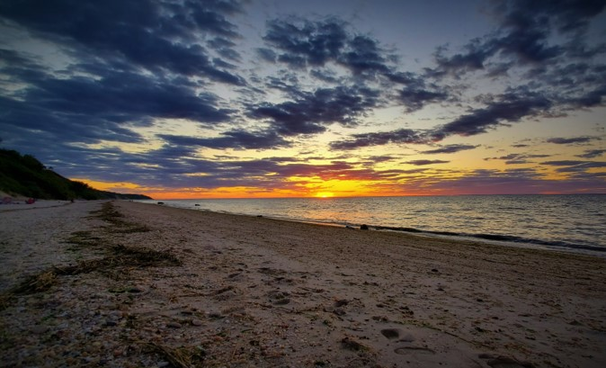

[**Home**](../index.md){:style="margin-right: 10px;"}
|
[**Projects**](../projects/index.md){:style="margin-right: 10px;margin-left: 10px"}
|
[**Research**](../research/index.md){:style="margin-right: 10px;margin-left: 10px;"}
|
[**Industry Experience**](../industryExperience/index.md){:style="margin-right: 10px;margin-left: 10px"}
|
**About Me**{:style="margin-left: 10px;"}

___

# About Me

Hi!

My name is Nick and this is my personal website!

My journey started in Long Island, NY. I grew up and spent most of my life there. Living on an island meant lots of time spent by the water. My summers were often filled with beach days and fishing. This is the view I had every summer night growing up, being a 5 minute walk to the beach.

After leaving Long Island to attend college, I journeyed my way down to Baltimore, Maryland to pursue my passion for engineering at The Johns Hopkins University. Hopkins was my home for 5 years, and has some pretty nice sights of its own! One of my favorite parts of campus is the view of the Gilman clock tower at sunset.

I graduated with my B.S. in Biomedical Engineering in May 2020. Unfortunately, due to the COVID-19 outbreak, my graduation was made virtual. So here I am, decked out in my cap and gown on virtual graduation day from home!

I then moved on to pursue my M.S.E. in Robotics Engineering, also at Johns Hopkins University. I graduated in May of 2021 (also a COVID graduation).

After finishing my master's I found myself moving up to Boston, Massachusetts where I now work as a Software Engineer at Globus Medical, working on some of the coolest medical robots in the industry!

Check out some of my personal projects I'm working on [**here**](../projects/index.md#projects)!

