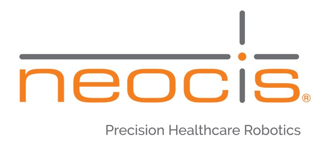

[**Home**](../index.md){:style="margin-right: 10px;"}
|
[**About Me**](../aboutMe/index.md){:style="margin-right: 10px;margin-left: 10px;"}
|
[**Research**](../research/index.md){:style="margin-right: 10px;margin-left: 10px;"}
|
**Industry Experience**{:style="margin-right: 10px;margin-left: 10px"}
|
[**Projects**](../projects/index.md){:style="margin-right: 10px;margin-left: 10px"}
|
[**Hobbies**](../hobbies/index.md){:style="margin-right: 10px;margin-left: 10px"}
|
[**Travel**](../travel/index.md){:style="margin-left: 10px"}

___

# Industry Experience

## Table of contents:
  - [Robotics Software Intern - Globus Medical (Summer 2020)](#robotics-software-intern---globus-medical-summer-2020)
  - [Robotics Software Intern - Neocis Inc. (Summer 2019)](#robotics-software-intern---neocis-inc-summer-2019)
  
___

## Robotics Software Intern - Globus Medical (Summer 2020)

[Return to Table of Contents](#table-of-contents)

{:style="margin-left: 10px;"}

- Designed a 1 kHz robotic simulation system to mimic the motion control of the ExcelsiusGPS spinal surgery robot
- Developed a 3D robotics model of the ExcelsiusGPS robot using the Webots simulation environment
- Implemented kinematics & motion control code that accurately simulates the movement of the physical robot
- Re-architected a variety of motion control libraries with CMake configuration to ensure seamless linkages to
both the physical and simulated robot
- This simulation is now being utilized at two sites worldwide to more effectively develop new control behaviors 
for the physical robot

___

## Robotics Software Intern - Neocis Inc. (Summer 2019)

[Return to Table of Contents](#table-of-contents)

- Designed and developed control software algorithms for implementation in the Yomi dental surgery robot
- Worked collaboratively with both hardware and software engineers to improve haptics control algorithms
- Developed a haptics algorithm to discriminate between active surgeon manipulation and an idle robot
  - Increased the accuracy of successfully detecting active surgeon manipulation by over 3000%
  - Greatly decreased the risk of movement drift when system is idle, minimizing patient risk during surgery