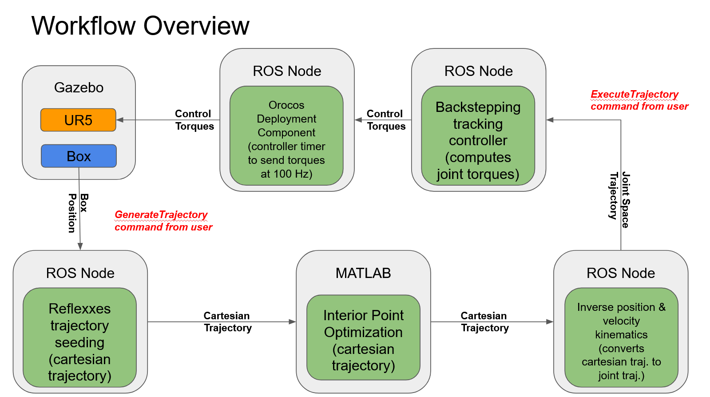

[**Home**](../index.md){:style="margin-right: 10px;"}
|
**Projects**{:style="margin-right: 10px;margin-left: 10px"}
|
[**Research**](../research/index.md){:style="margin-right: 10px;margin-left: 10px;"}
|
[**Industry Experience**](../industryExperience/index.md){:style="margin-right: 10px;margin-left: 10px"}
|
[**About Me**](../aboutMe/index.md){:style="margin-right: 10px;margin-left: 10px;"}

___

# Projects

```diff
- This page is currently undergoing some work. Some content may be missing or incomplete.
```

## Table of contents:
### Robotics Projects:
- Kendama-bot: The Kendama Playing UR5
- UR5 Box Sorting Robot
- DRAKE Robot Simulation

### Software Projects:
- Command Line Chess
- Command Line Photoshop

### Coming Soon:
- Optimal Control of Two-link Robot Arm
- Optimal Control of Quadrupedal Robot
- EOG Controlled RC Car
- Personal Heart Rate Monitor

___
## Kendama-bot: The Kendama Playing UR5

[Return to Table of Contents](#table-of-contents)

**Topics of interest:**
- Robotics
- ROS
- Gazebo Simulation

This project was part of my Master's course work. The aim was to control the UR5 robotic arm to play [Kendama](https://en.wikipedia.org/wiki/Kendama). The proect was first developed on a simulated UR5 using ROS & Gazebo. We then deployed our code onto a physical UR5.

<p align="center">
<strong>Kendata-Bot in action!</strong>
</p>

<p align="center">
<iframe width="560" height="315" src="https://www.youtube.com/embed/W81ucJehiYE" title="YouTube video player" frameborder="0" allow="accelerometer; autoplay; clipboard-write; encrypted-media; gyroscope; picture-in-picture" allowfullscreen></iframe>
</p>

<p align="center">
<strong>Simulated ball tracking & catching in Gazebo:</strong>
</p>

<p align="center">
<iframe width="560" height="315" src="https://www.youtube.com/embed/dfKX0M3ABXM" title="YouTube video player" frameborder="0" allow="accelerometer; autoplay; clipboard-write; encrypted-media; gyroscope; picture-in-picture" allowfullscreen></iframe>
</p>

<p align="center">
<strong>Simulated ball launching in Gazebo:</strong>
</p>

<p align="center">
<iframe width="560" height="315" src="https://www.youtube.com/embed/3MrRn420GkI" title="YouTube video player" frameborder="0" allow="accelerometer; autoplay; clipboard-write; encrypted-media; gyroscope; picture-in-picture" allowfullscreen></iframe>
</p>

___
## UR5 Box Sorting Robot

[Return to Table of Contents](#table-of-contents)

**Topics of interest:**
- Robotics
- Optimal Trajectory Generation
- Nonlinear Control Systems
- ROS
- Gazebo Simulation

This project was part of my Master's course work. The aim was to control the UR5 robotic arm to sort packages in a manufacturing setting. We utilized [Constrained Nonlinear Optimization](https://en.wikipedia.org/wiki/Nonlinear_programming) to generate optimal trajectories for the UR5 with built in obstacle avoidance. We then utilized a [Nonlinear Backstepping Controller](https://en.wikipedia.org/wiki/Backstepping) to follow the optimized trajectories. The project was developed on a simulated UR5 using ROS & Gazebo.

<p align="center">
<strong>Simulated UR5 Box Sorting Trajectory Tracking</strong>

<iframe width="560" height="315" src="https://www.youtube.com/embed/3Oi9Dar5aA8" title="YouTube video player" frameborder="0" allow="accelerometer; autoplay; clipboard-write; encrypted-media; gyroscope; picture-in-picture" allowfullscreen></iframe>
</p>

<p align="center">
<strong>Trajectory Optimization for Obstacle Avoidance</strong>
</p>

<p align="center">

</p>

<p align="center">
<strong>Workflow Diagram</strong>
</p>

<p align="center">

</p>


___
## Command Line Chess

[Return to Table of Contents](#table-of-contents)

[Github Repo](https://github.com/Nick7244/RobotArmOptimalControl)

**Topics of interest:**
- C++ Programming

[INSERT IMAGE HERE]
___

## Homemade Photoshop

[Return to Table of Contents](#table-of-contents)

**Topics of interest:**
- C++ Programming
- Image Processing

[INSERT IMAGE HERE]
