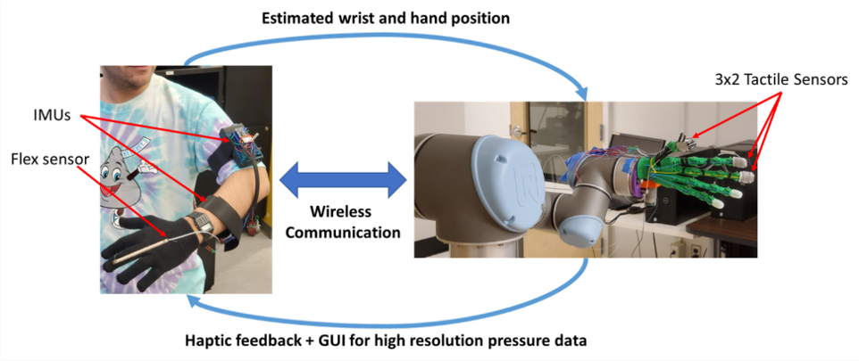

[**Home**](../index.md){:style="margin-right: 10px;"}
|
**Projects**{:style="margin-right: 10px;margin-left: 10px"}
|
[**Research**](../research/index.md){:style="margin-right: 10px;margin-left: 10px;"}
|
[**Industry Experience**](../industryExperience/index.md){:style="margin-right: 10px;margin-left: 10px"}
|
[**About Me**](../aboutMe/index.md){:style="margin-left: 10px;"}

___

# Projects

## Table of contents:
### Robotics Projects:
- [Kendama-bot: The Kendama Playing UR5](#kendama-bot-the-kendama-playing-ur5)
- [UR5 Box Sorting Robot](#ur5-box-sorting-robot)
- [Tele-operated Palpation Robot](#tele-operated-palpation-robot-in-progress)
- [Underatuated Robotics: Drake Simulation](#underatuated-robotics-drake-simulation)

### Software Projects:
- [Command Line Chess](#command-line-chess)
- [Command Line Photoshop](#command-line-photoshop)

___
## Kendama-bot: The Kendama Playing UR5

[Return to Table of Contents](#table-of-contents)

**Topics of interest:**
- Robotics
- ROS
- Gazebo Simulation

This project was part of my Master's course work. The aim was to control the UR5 robotic arm to play [Kendama](https://en.wikipedia.org/wiki/Kendama). The proect was first developed on a simulated UR5 using ROS & Gazebo. We then deployed our code onto a physical UR5.

<strong>Kendata-Bot in action!</strong>

<iframe width="560" height="315" src="https://www.youtube.com/embed/W81ucJehiYE" title="YouTube video player" frameborder="0" allow="accelerometer; autoplay; clipboard-write; encrypted-media; gyroscope; picture-in-picture" allowfullscreen></iframe>

<strong>Simulated ball tracking & catching in Gazebo:</strong>

<iframe width="560" height="315" src="https://www.youtube.com/embed/dfKX0M3ABXM" title="YouTube video player" frameborder="0" allow="accelerometer; autoplay; clipboard-write; encrypted-media; gyroscope; picture-in-picture" allowfullscreen></iframe>

<strong>Simulated ball launching in Gazebo:</strong>

<iframe width="560" height="315" src="https://www.youtube.com/embed/3MrRn420GkI" title="YouTube video player" frameborder="0" allow="accelerometer; autoplay; clipboard-write; encrypted-media; gyroscope; picture-in-picture" allowfullscreen></iframe>

___
## UR5 Box Sorting Robot

[Return to Table of Contents](#table-of-contents)

**Topics of interest:**
- Robotics
- Optimal Trajectory Generation
- Nonlinear Control Systems
- ROS
- Gazebo Simulation

This project was part of my Master's course work. The aim was to control the UR5 robotic arm to sort packages in a manufacturing setting. We utilized [Constrained Nonlinear Optimization](https://en.wikipedia.org/wiki/Nonlinear_programming) to generate optimal trajectories for the UR5 with built in obstacle avoidance. We then utilized a [Nonlinear Backstepping Controller](https://en.wikipedia.org/wiki/Backstepping) to follow the optimized trajectories. The project was developed on a simulated UR5 using ROS & Gazebo.

<strong>Simulated UR5 Box Sorting Trajectory Tracking</strong>

<iframe width="560" height="315" src="https://www.youtube.com/embed/3Oi9Dar5aA8" title="YouTube video player" frameborder="0" allow="accelerometer; autoplay; clipboard-write; encrypted-media; gyroscope; picture-in-picture" allowfullscreen></iframe>

<strong>Trajectory Optimization for Obstacle Avoidance</strong>

<strong>Workflow Diagram</strong>

___

## Tele-operated Palpation Robot ***(In progress!)***

[Return to Table of Contents](#table-of-contents)

**Topics of interest:**
- Medical Robotics
- ROS
- Gazebo Simulation
- Robot Kinematics
- Sensor Fusion

This project was completed during my Senior year in Undergrad for the Honors Instrumentation course under Dr. Nitish Thakor at JHU. The aim of the project was to utilize the UR5 robot arm for tele-operated palpation tasks. To accomplish this, me and my project team built a wireless arm tracker which could estimate the user's wrist position relative to their shoulder over time, utilizing the Madgwick sensor fusion algorithm on a pair of 9-DOF IMU sensors. This wrist position is then sent to the UR5 over bluetooth, where it is used as input to the inverse kinematics for control over the UR5. The UR5 then moves to achieve the same end-effector position as the user's wrist, running at a sampling rate of ~20 Hz. For the palpation side of the project, we built a tactile sensing palpation probe that attaches to the end-effector of the UR5. Using a grid array of piezoelectric fabric strips as well as a pair of thermistors, we are able to sense pressure and temperature information from the skin of the patient. This information is then fed back to the user in two different forms of feedback. A GUI heat map demonstrates visually the levels of pressure for each segment of the grid array and the relative temperature of the two thermistors, while buzzer motors in a glove worn by the user provides haptic feedback of the level of pressure felt by the probe.

___

## Underatuated Robotics: Drake Simulation

[Return to Table of Contents](#table-of-contents)

[Github Repo]

**Topics of interest:**
- Robot Kinematic & Dynamics
- Nonlinear Control

[INSERT IMAGE HERE]

___

## Command Line Chess

[Return to Table of Contents](#table-of-contents)

[Github Repo]

**Topics of interest:**
- C++ Programming

[INSERT IMAGE HERE]

___

## Command Line Photoshop

[Return to Table of Contents](#table-of-contents)

[Github Repo]

**Topics of interest:**
- C++ Programming
- Image Processing

[INSERT IMAGE HERE]
