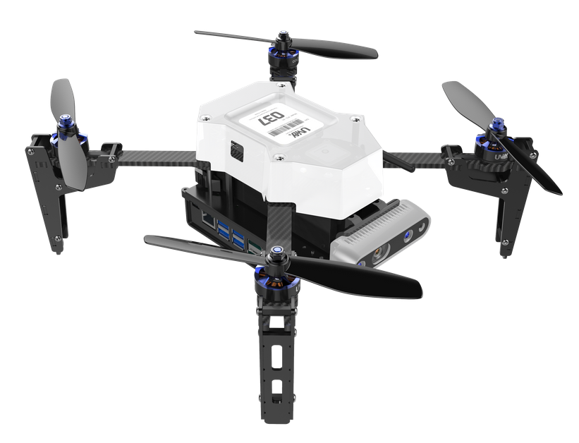
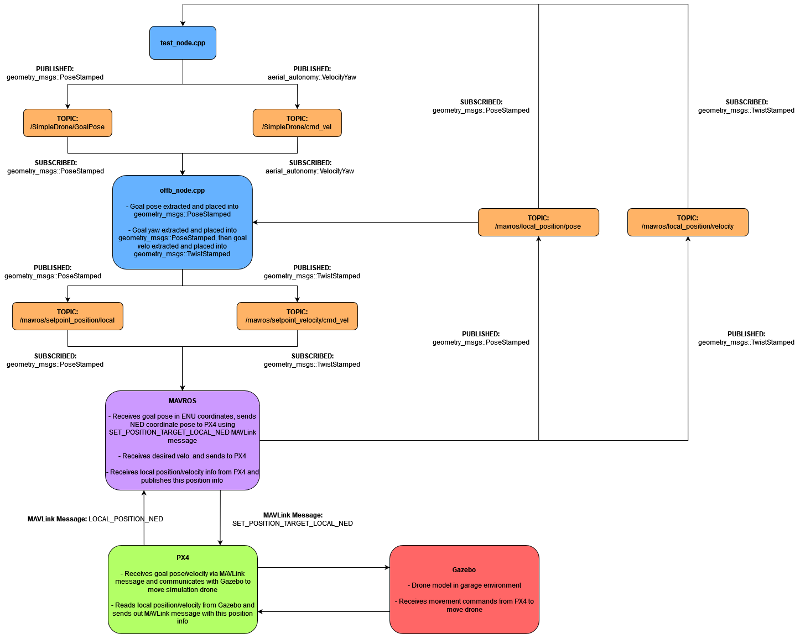
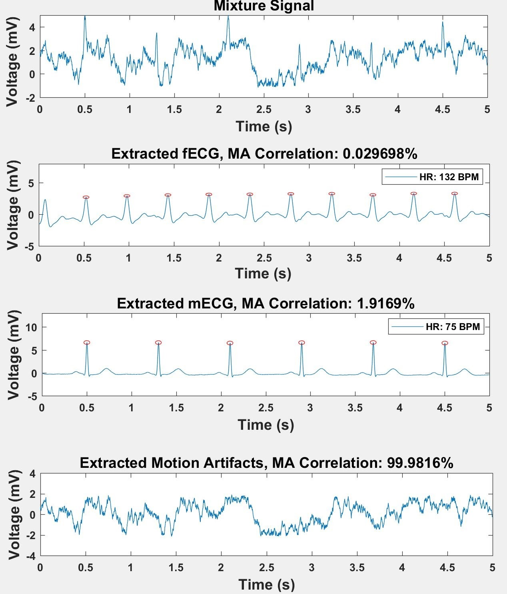

[**Home**](../index.md){:style="margin-right: 10px;"}
|
[**Projects**](../projects/index.md){:style="margin-right: 10px;margin-left: 10px"}
|
**Research**{:style="margin-right: 10px;margin-left: 10px;"}
|
[**Industry Experience**](../industryExperience/index.md){:style="margin-right: 10px;margin-left: 10px"}
|
[**About Me**](../aboutMe/index.md){:style="margin-right: 10px;margin-left: 10px;"}

___

# Research

## Table of contents:

- [Simulating an Autonomous Drone for Aerial Manipulation](#simulating-an-autonomous-drone-for-aerial-manipulation)
- [PediaCORE ADAPT System](#pediacore-adapt-system)
- [Fetal-Maternal Dual Heart Monitoring System](#fetal-maternal-dual-heart-monitoring-system)

___

## Simulating an Autonomous Drone for Aerial Manipulation

[Return to Table of Contents](#table-of-contents)

**Topics of interest:**
- Autonomous Systems
- Aerial Robotics
- Gazebo Simulation
- ROS

{:style="margin-left: 30px;"}
This project is being completed through the [Autonomous Systems, Control and Optimization (ASCO) lab](https://asco.lcsr.jhu.edu/), run my Dr. Marin Kobilarov. The overall goal of the project is to develop an autonomous drone with an attached gripper that can recognize objects of interest and carry out aerial manipulation tasks. The aim of this sub-portion of the project is to develop a Gazebo simulation with ROS integration for the [IFO-S research platform](https://www.uvify.com/ifo-s/). This will then be used in the development of motion planning and perception algorithms for the drone. To properly simulate the drone, the PX4 flight controller will be utilized within the Gazebo simulation.

 
<strong>Workflow Diagram</strong>

___

## PediaCORE ADAPT System

[Return to Table of Contents](#table-of-contents)

**Topics of interest:**
- Medical Device Research & Development
- Pediatric Physical Therapy
- Unity Game Development

{:style="margin-left: 30px;"}
PediaCORE is a former JHU BME Design Team turned independent research group now housed within the Kennedy Krieger Institute (KKI). Sponsored by Dr. Amy Bastian, Chief Science Officer of KKI, PediaCORE initially formed in the spring of 2018, with the goal of making physical therapy more engaging for children with motor disabilities. Since then, we have developed the ADAPT system, specifically with this goal in mind. As one of the original founders of the team, I have recently taken over the role of Lead Project Manager, and have been in this new leadership position since May 2020. I have since led our team of 12, consisting of undergraduate students, graduate students, and young professionals, through our ongoing first round of clinical studies. We are actively engaging and collaborating with Physical Therapists, Neuroscience experts, and Child Behavioral Psychologists to ensure the ADAPT system is a success. We look forward to seeing what the ADAPT system can accomplish, and sharing more details soon!

This work was presented at the 2019 BMES Annual Meeting:

- Ramesh S, Gelaf Romer T, Bergamaschi T, Sanyal A, **Maritato N**, Park J, Parise S, Li M, Bastian A. Providing a Low-Cost Virtual Reality Physiotherapy Alternative for Children with Cerebral Palsy. Poster presented at: Biomedical Engineering Society Annual Conference; 2019 October 16-19; Philadelphia, PA.

___

## Fetal-Maternal Dual Heart Monitoring System

[Return to Table of Contents](#table-of-contents)

**Topics of interest:**
- Wearable Medical Devices
- Digital Signal Processing
- Healthcare Monitoring

{:style="margin-left: 30px;"}
This project was completed as part of the REU program at University of Washington, Bothell. I worked under Dr. Hung Cao and Dr. Tadesse Ghirmai to develop an algorithm that could take abdominal ECG (aECG) data from a pregnant mother, extract out the separate fetal ECG (fECG) and maternal ECG (mECG) signals, while simultaneously removing any motion artifacts present in the signal. This algorithm utilizes Independent Component Analysis (ICA) for signal extraction, and an analysis was done comparing results from using FastICA vs. RobustICA. This system was implemented in a wireless electrode system that uses Bluetooth Low Energy to stream the data to the user's phone. The Android app I developed processes the data, completes the ICA extraction, and displays the fECG, mECG and associated heart rate calculations.

This work was published at the 2019 IEEE IMBioC Conference, and presented at the 2018 BMES Annual Meeting:

- Le T, Fortunato J, **Maritato N**, Cho Y, et al. Home-based mobile fetal/maternal electrocardiogram acquisition and extraction with cloud assistance. Paper presented at: IEEE-IMBIoC 2019 Conference; 2019 May 6-8; Nanjing, China.
- **Maritato N**, Cho Y, et al. Continuous Maternal and Fetal ECG Extraction and Monitoring System with Secure Bluetooth Low Energy Connection. Poster presented at: Biomedical Engineering Society Annual Conference; 2018 October 17-20; Atlanta, GA.