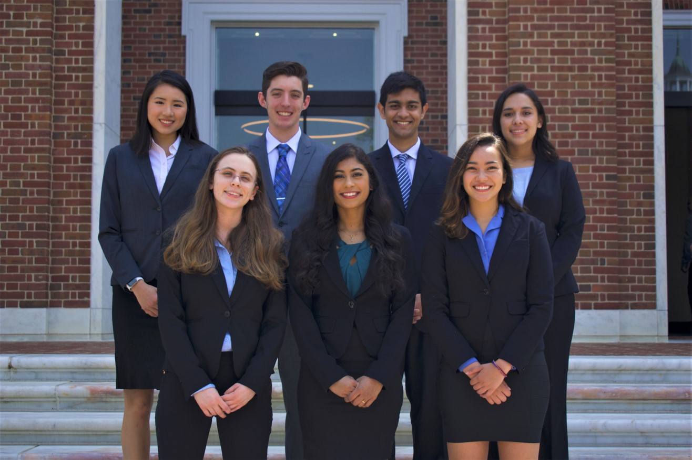

[**Home**](../index.md){:style="margin-right: 10px;"}
|
[**About Me**](../aboutMe/index.md){:style="margin-right: 10px;margin-left: 10px;"}
|
**Research**{:style="margin-right: 10px;margin-left: 10px;"}
|
[**Industry Experience**](../industryExperience/index.md){:style="margin-right: 10px;margin-left: 10px"}
|
[**Projects**](../projects/index.md){:style="margin-right: 10px;margin-left: 10px"}
|
[**Hobbies**](../hobbies/index.md){:style="margin-right: 10px;margin-left: 10px"}
|
[**Travel**](../travel/index.md){:style="margin-left: 10px"}

___

# Research

## Table of contents:

- [Tele-operated Palpation Robot](#tele-operated-palpation-robot-in-progress) ***(In progress!)***
- [PediaCORE ADAPT System](#pediacore-adapt-system-in-progress) ***(In progress!)***
- [Fetal-Maternal Dual Heart Monitoring System](#fetal-maternal-dual-heart-monitoring-system)

___

## Tele-operated Palpation Robot ***(In progress!)***

[Return to Table of Contents](#table-of-contents)

This project was completed for the Honors Instrumentation course under Dr. Nitish Thakor at JHU. The aim of the project was to utilize the UR5 robot for remote palpation tasks.

**Topics of interest:**
- Medical Robotics
- ROS / Gazebo Simulation
- Robot Kinematics
- Robot Sensors & Actuators
- MATLAB Programming
- Arduino Programming

***Stay tuned, more to come soon!***

___

## PediaCORE ADAPT System ***(In progress!)***

[Return to Table of Contents](#table-of-contents)

{:style="margin-left: 10px;"}
PediaCORE is a former JHU BME Design Team turned independent research group now housed within the Kennedy Krieger Institute (KKI). Sponsored by Dr. Amy Bastian, Chief Science Officer of KKI, PediaCORE initially formed in the spring of 2018, with the goal of making physical therapy more engaging for children with motor disabilities. Since then, we have developed the ADAPT system, specifically with this goal in mind. As one of the original founders of the team, I have recently taken over the role of Lead Project Manager, and have been in this new leadership position since May 2020. I have since led our team of 12, consisting of undergraduate students, graduate students, and young professionals, through our ongoing first round of clinical studies. We are actively engaging and collaborating with Physical Therapists, Neuroscience experts, and Child Behavioral Psychologists to ensure the ADAPT system is a success. We look forward to seeing what the ADAPT system can accomplish, and sharing more details soon!

**Topics of interest:**
- Medical Device Start-up
- Prototype Research & Development
- Physical Therapy Data Analysis
- Unity Game Development

***Stay tuned, more to come soon!***

___

## Fetal-Maternal Dual Heart Monitoring System

[Return to Table of Contents](#table-of-contents)

{:style="margin-left: 10px;"}
This project was completed through the REU program at University of Washington, Bothell. I worked under Dr. Hung Cao and Dr. Tadesse Ghirmai to develop an algorithm that could take abdominal ECG (aECG) data from a pregnant mother, extract out the separate fetal ECG (fECG) and maternal ECG (mECG) signals, while simultaneously removing any motion artifacts present in the signal. This algorithm utilizes Independent Component Analysis (ICA), and an analysis was done comparing results from using FastICA vs. RobustICA.

**Topics of interest:**
- Wearable Medical Devices
- Digital Signal Processing
- MATLAB Programming
- C++ Programming

***Stay tuned, more to come soon!***